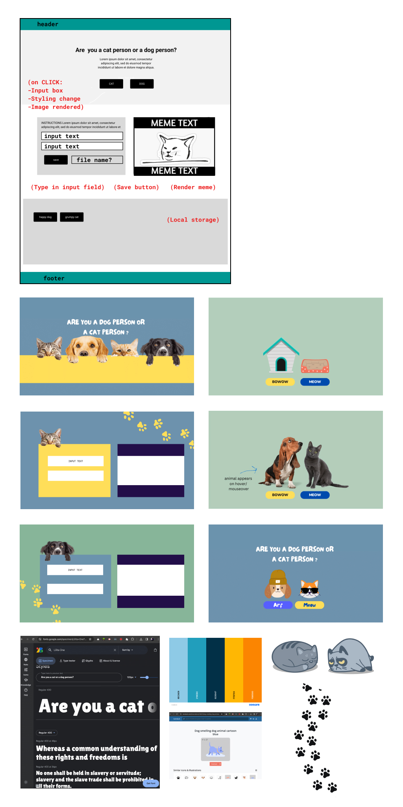
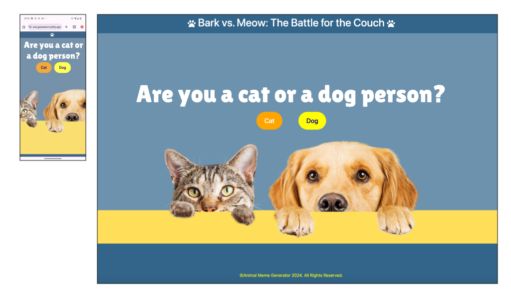
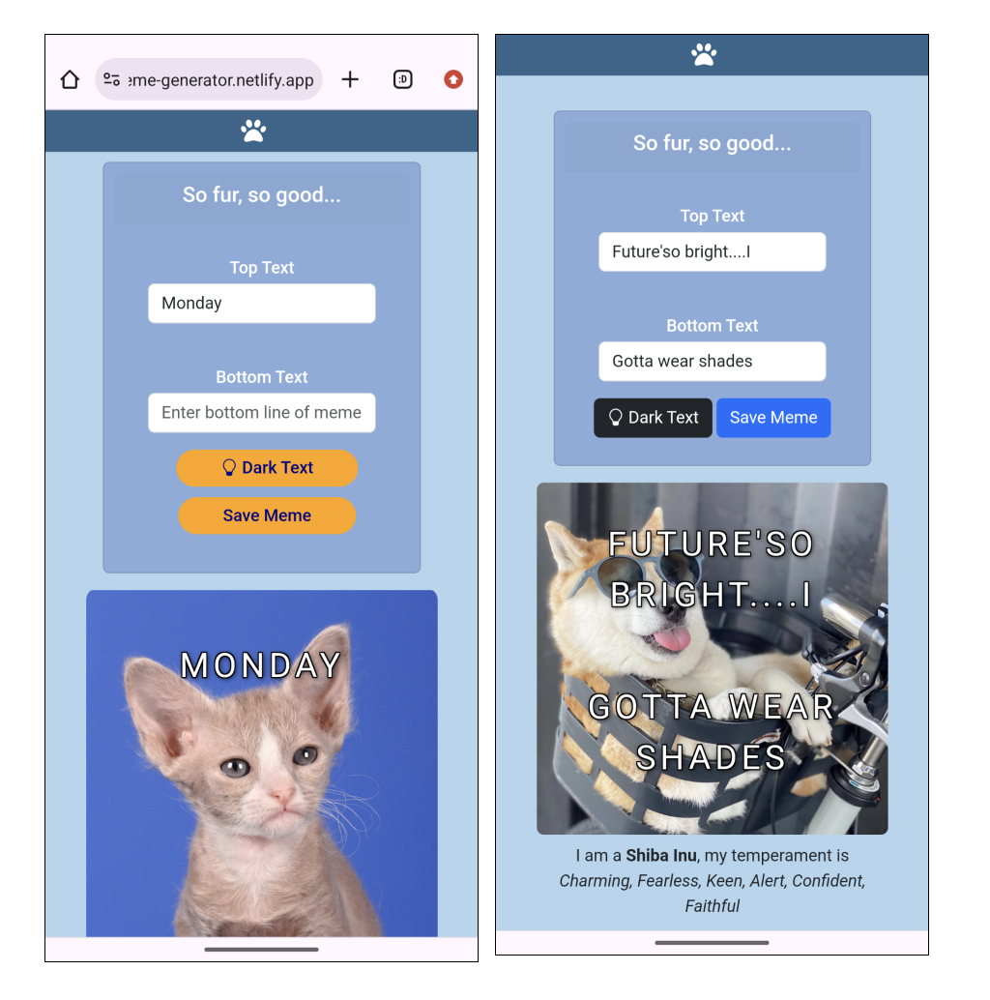
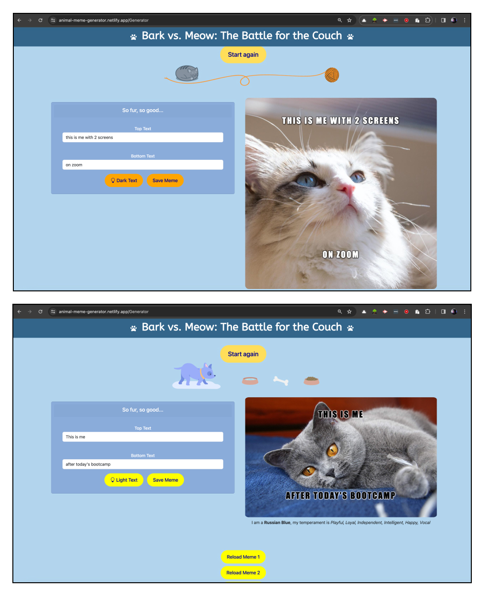
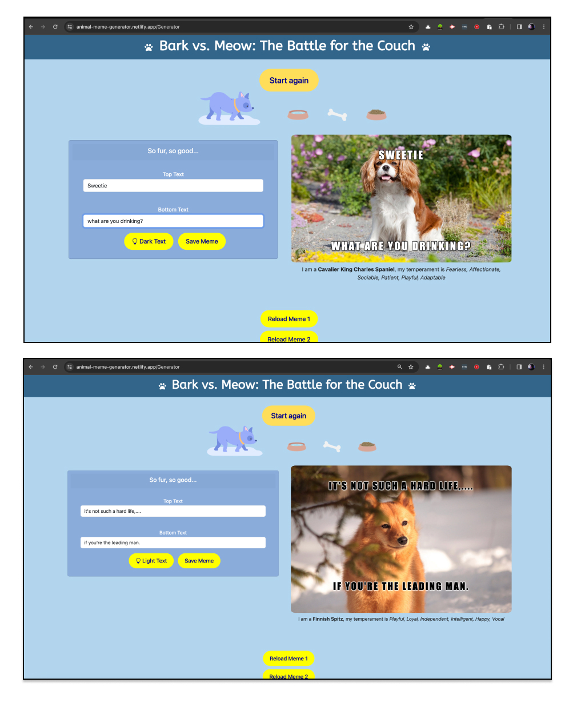
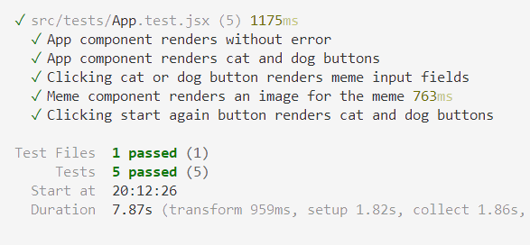

# Bark vs. Meow: The Battle for the Couch

## Contents

* [Description](#description)
* [Design](#design)
* [Build](#build)
* [Usage](#usage)
* [Testing](#testing)
* [Credits](#credits)
* [License](#license)
* [Acknowledgments](#acknowledgments)
* [References](#references)

## Description

Bark vs. Meow is a fun meme generator which provides people a fun way to create cat or dog based memes in their web browser.

This project fullfils the criteria of building a a performant and scalable front-end single-page (React) application that fulfills a real-world need, with a focus on data and user demand. It features a clean and responsive user interface and utilises HTML, CSS, Bootstrap, JavaScript, React, Node.js.

Bark vs. Meow makes use of two APIs which provide images and associated breed information to the application: [TheCatAPI](https://thecatapi.com) and [TheDogAPI](https://www.thedogapi.com).

## Design

Initial wireframe and design stages

Landing Page, mobile and Desktop

Android screenshots, meme pages

Mac screenshots, cat page

Mac screenshots, dog pages

## Usage

Access the deployed application at the following URL: https://animal-meme-generator.netlify.app

Bark vs. Meow runs in the browser and allows users to generate a new meme via a button depending on their preference: a cat or a dog. The associated API is then called and returns an image along with associated breed information. The user can then populate the meme with any text of their choice.

Once a meme has been completed by the user, they can save their meme locally (to the browser) and later retrieve it by clicking on the image on the page.

Bark vs. Meow has an aesthetically pleasing and accessible user interface which utilises Bootstrap as well as taking into account accessibility concerns such as utilising an accessible colour scheme, semantic HTML, alt attributes and ARIA labels.

## Built with

       

## Testing

Following a  Behavior-Driven Development (BDD) methodology, Bark vs. Meow uses [Vitest](https://vitest.dev/) with [React Testing Library](https://testing-library.com/docs/react-testing-library/intro/) for testing the application's behaviour. During development, the following behaviours were tested:

1. The App component renders without throwing an error.
1. The cat and dog buttons render in the App component.
1. When the user clicks the cat or dog button, input fields (for the meme text) are rendered.
1. The meme image is rendered in the Meme component.
1. When the user clicks the start again button, the cat and dog buttons are rendered (again).

At the time of publishing this README, all tests pass:

## Contributors

codeswitchstudio: https://github.com/codeswitchstudio

Code0Em: https://github.com/Code0Em

dami-ani: https://github.com/dami-ani

kbearne: https://github.com/kbearne

yasmiinanon: https://github.com/yasmiinanon

## Credits

### Design Resources

* **Wireframe**: Figma
* **Colour Pallete**: Coolors (no date) [*The super fast color palettes generator!*](https://coolors.co/).
* **Colour Contrast Checker**: Accessibility Checker (no date) [*Accessibility Color Contrast Checker WCAG Compliance*](https://www.accessibilitychecker.org/color-contrast-checker/).

### Technologies

* [TheCatAPI](https://thecatapi.com)
* [TheDogAPI](https://www.thedogapi.com)

### Other 

All other credits are cited in the code comments and referenced below.

## License

Select the badge or visit the `LICENSE.txt` (above) for more information.

## References

DEV Community (2024) [*Introduction to Testing React Components with Vite, Vitest and React Testing Library*](https://dev.to/brslv/introduction-to-testing-react-components-with-vite-vitest-and-react-testing-library-8cb).

freeCodeCamp (2022) [*How to Write Unit Tests for React Apps*](https://www.freecodecamp.org/news/write-unit-tests-using-react-testing-library/).

Timothy Amo (2021) [*Testing Conditional Render In React*](https://www.youtube.com/watch?v=To2PzUT1lQ4).

